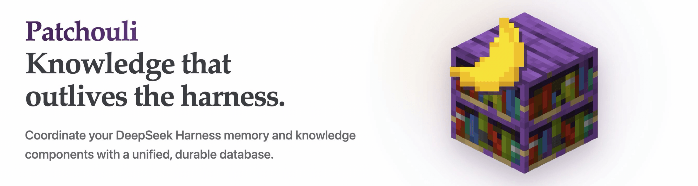

  

  <h1>Patchouli</h1>
  

    <strong>Knowledge and memory middleware for AI harnesses.</strong>
     
    Connect applications, memory plugins, and durable knowledge storage through one common service.
  

  
  
  
  

  **English** / [简体中文](README.zh-CN.md)

## Overview

Patchouli is a knowledge and memory middleware layer. Applications call a
stable `update` / `retrieve` / `subscribe` service, registered plugins provide
the memory semantics, and an independent Rust backend provides transactional
storage.

[DeepSeek Harness](https://github.com/deepseek-ai/deepseek-harness) is the first
supported integration. The database backend remains harness-neutral.

## Capabilities

- Common DSH Memory Service with plugin routing, aggregation, and provenance.
- Agent Loop hooks and model tools through a dedicated connector plugin.
- Pluggable local or remote memory and knowledge implementations.
- Managed image and workspace-file ingestion as typed Artifacts.
- Durable cursors and reactive subscriptions.
- Transactional Rust backend with SQLite, remote providers, conflict handling,
  change streams, and lifecycle recovery.

## Documentation

Read the [Patchouli documentation](https://memorax-agent.github.io/dsh-patchouli/)
for installation, DSH integration, architecture, consistency configuration,
the knowledge model, and backend operation.

The source pages live in [`docs/`](docs/). The normative JSON-RPC contract lives
in [`packages/protocol/SPEC.md`](packages/protocol/SPEC.md).

## Status

The Memory Service, Agent Loop connector, Artifact Ingestor, transactional Rust
backend, SQLite and remote providers, conflict handling, change streams, and
lifecycle recovery are implemented. Session and Workspace Indexers currently
define package boundaries; a general-purpose Knowledge extraction plugin is not
included yet.

## License

Licensed under the [MIT License](LICENSE).

## What does the plugin's name mean???

The name refers directly to
[Patchouli Knowledge](https://en.touhouwiki.net/wiki/Patchouli_Knowledge), and
also pays tribute to the widely known Minecraft mod
[Patchouli](https://github.com/VazkiiMods/Patchouli).
