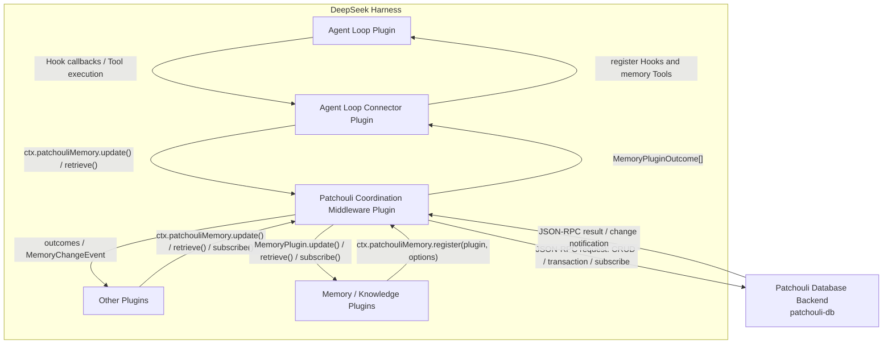

<div align="center">
  

  <h1>Patchouli</h1>
  <p>
    <strong>Knowledge and memory middleware for AI harnesses.</strong>
    <br />
    Connect applications, memory plugins, and durable knowledge storage through one common service.
  </p>

  [](https://github.com/memorax-agent/dsh-patchouli/actions/workflows/ci.yml)
  [](LICENSE)
  [](package.json)
  [](Cargo.toml)

  **English** / [简体中文](README.zh-CN.md)
</div>

## Overview

Patchouli is a knowledge and memory middleware layer. Applications call a
stable `update` / `retrieve` / `subscribe` service, registered plugins provide
the memory semantics, and an independent Rust backend provides transactional
storage.

[DeepSeek Harness](https://github.com/deepseek-ai/deepseek-harness) is the first
supported integration. The database backend remains harness-neutral.

## Capabilities

- Common DSH Memory Service with plugin routing, aggregation, and provenance.
- Agent Loop hooks and model tools through a dedicated connector plugin.
- Pluggable local or remote memory and knowledge implementations.
- Managed image and workspace-file ingestion as typed Artifacts.
- Durable cursors and reactive subscriptions.
- Transactional Rust backend with SQLite, remote providers, conflict handling,
  change streams, and lifecycle recovery.

## Architecture



The large box contains DSH plugins. `patchouli-db` runs independently. Each
direction has its own arrow for calls, results, callbacks, or notifications.

## Status

Implemented today:

- DSH Memory Service, Agent Loop connector, Artifact Ingestor, and cursor store;
- typed Knowledge, Relation, and Artifact entities;
- transactions, conflict resolution, retrieval, subscriptions, and local or
  remote provider routing;
- daemon lifecycle, checkpoints, WAL recovery, and managed Artifact storage.

Session and Workspace Indexers currently define package boundaries only. A
general-purpose Knowledge extraction and retrieval plugin is not included yet.

## Getting started

Requirements: Node.js `^22.19.0` or `>=24.0.0`, pnpm 11, and Rust stable.

```bash
corepack enable
pnpm install
pnpm check
cargo test --workspace
```

Install the current checkout into a local DSH profile:

```bash
pnpm pack
dsh plugin --profile web add .
dsh --profile web --dump-config
```

Install the optional `patchouli-db` backend on macOS or Linux:

```bash
curl -fsSL https://raw.githubusercontent.com/memorax-agent/dsh-patchouli/main/scripts/install.sh | sh
```

Windows PowerShell:

```powershell
irm https://raw.githubusercontent.com/memorax-agent/dsh-patchouli/main/scripts/install.ps1 | iex
```

The installer initializes `~/.patchouli` without overwriting existing
configuration. It does not modify a DSH profile or install a system service.

## Documentation

- [Architecture](docs/architecture.md)
- [Knowledge model](docs/knowledge-model.md)
- [Backend configuration](docs/backend-configuration.md)
- [Backend installation](docs/installation.md)
- [Development and CI](docs/development.md)
- [JSON-RPC protocol](packages/protocol/SPEC.md)

## License

Licensed under the [MIT License](LICENSE).

## What does the plugin's name mean???

The name refers directly to
[Patchouli Knowledge](https://en.touhouwiki.net/wiki/Patchouli_Knowledge), and
also pays tribute to the widely known Minecraft mod
[Patchouli](https://github.com/VazkiiMods/Patchouli).
