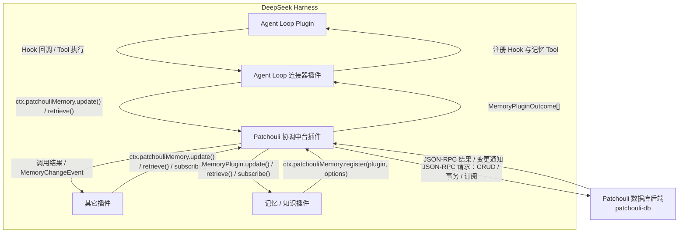

<div align="center">
  

  <h1>Patchouli</h1>
  <p>
    <strong>面向 AI Harness 的知识与记忆中台。</strong>
    <br />
    通过统一服务连接应用、记忆插件与持久化知识存储。
  </p>

  [](https://github.com/memorax-agent/dsh-patchouli/actions/workflows/ci.yml)
  [](LICENSE)
  [](package.json)
  [](Cargo.toml)

  [English](README.md) / **简体中文**
</div>

## 概述

Patchouli 是一个知识与记忆中台。应用通过稳定的 `update`、`retrieve`、`subscribe` 服务发起调用，注册插件提供具体记忆语义，独立的 Rust 后端负责事务化存储。

[DeepSeek Harness](https://github.com/deepseek-ai/deepseek-harness) 是目前首个受支持的集成，数据库后端本身不依赖任何 Harness。

## 核心能力

- 提供带插件路由、聚合和来源标记的 DSH Memory Service。
- 通过独立连接器插件接入 Agent Loop Hook 与模型 Tool。
- 支持本地或远程记忆/知识插件。
- 将图片和工作区文件摄取为类型化 Artifact。
- 提供持久化 cursor 与响应式订阅。
- 提供支持 SQLite、远程 Provider、冲突处理、变更流和故障恢复的事务化 Rust 后端。

## 架构



大框内是 DSH 插件，`patchouli-db` 独立运行。每个方向分别使用一条箭头表示调用、结果、回调或通知。

## 当前状态

目前已经实现：

- DSH Memory Service、Agent Loop 连接器、Artifact Ingestor 和 cursor store；
- Knowledge、Relation 与 Artifact 类型化实体；
- 事务、冲突处理、检索、订阅，以及本地/远程 Provider 路由；
- daemon 生命周期、checkpoint、WAL 恢复和受管 Artifact 文件库。

Session 与 Workspace Indexer 目前只完成包边界；通用 Knowledge 抽取与检索插件尚未提供。

## 快速开始

环境要求：Node.js `^22.19.0` 或 `>=24.0.0`、pnpm 11 和 Rust stable。

```bash
corepack enable
pnpm install
pnpm check
cargo test --workspace
```

将当前 checkout 安装到本地 DSH profile：

```bash
pnpm pack
dsh plugin --profile web add .
dsh --profile web --dump-config
```

在 macOS 或 Linux 安装可选的 `patchouli-db` 后端：

```bash
curl -fsSL https://raw.githubusercontent.com/memorax-agent/dsh-patchouli/main/scripts/install.sh | sh
```

Windows PowerShell：

```powershell
irm https://raw.githubusercontent.com/memorax-agent/dsh-patchouli/main/scripts/install.ps1 | iex
```

安装器会在不覆盖现有配置的前提下初始化 `~/.patchouli`，不会修改 DSH profile 或注册系统服务。

## 详细文档

- [架构](docs/architecture.md)
- [知识模型](docs/knowledge-model.md)
- [后端配置](docs/backend-configuration.md)
- [后端安装](docs/installation.md)
- [开发与 CI](docs/development.md)
- [JSON-RPC 协议](packages/protocol/SPEC.md)

## 许可

项目采用 [MIT License](LICENSE)。

## 这个插件的名字是什么意思？？？

名称直接来自 [Patchouli Knowledge](https://en.touhouwiki.net/wiki/Patchouli_Knowledge)，同时致敬广为人知的 Minecraft 模组 [Patchouli](https://github.com/VazkiiMods/Patchouli)。
