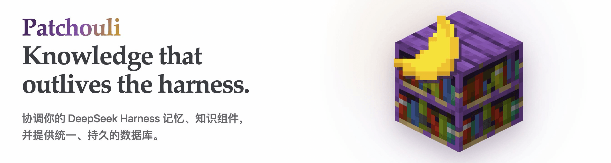

  

  <h1>Patchouli</h1>
  

    <strong>面向 DeepSeek Harness 的本地记忆和知识中枢。</strong>
     
    以数据、算法解耦的形式，对异构的 Agent 数据增强进行整合。
  

  [English](README.md) · **简体中文**

  
  
  
  
  

## 概述

Patchouli 在 [DeepSeek Harness](https://github.com/deepseek-ai/deepseek-harness)
内提供统一的 `update`、`retrieve`、`subscribe` 服务。连接器负责提供可信的运行时数据，
记忆和知识插件负责各自的算法，独立的 Rust 后端负责持久化事务存储。

DeepSeek Harness 是目前首个受支持的集成，数据库后端本身不依赖任何 Harness。

## 核心能力

- 提供由插件控制路由、聚合和来源标记的统一 Memory Service。
- 通过可配置 Hook 和模型 Tool 接入 Agent Loop。
- 支持本地或远程记忆与知识实现。
- 将图片和工作区文件摄取为类型化 Artifact。
- 提供持久化订阅，以及支持 SQLite 和远程 Provider 的事务化 Rust 后端。

## 这个插件的名字是什么意思？？？

名称直接来自 [Patchouli Knowledge](https://en.touhouwiki.net/wiki/Patchouli_Knowledge)，同时致敬广为人知的 Minecraft 模组 [Patchouli](https://github.com/VazkiiMods/Patchouli)。
